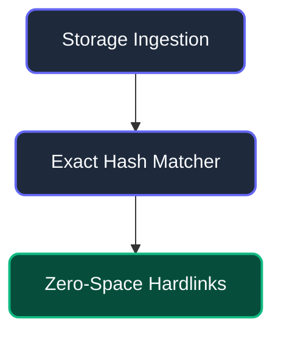
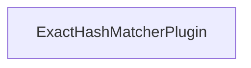
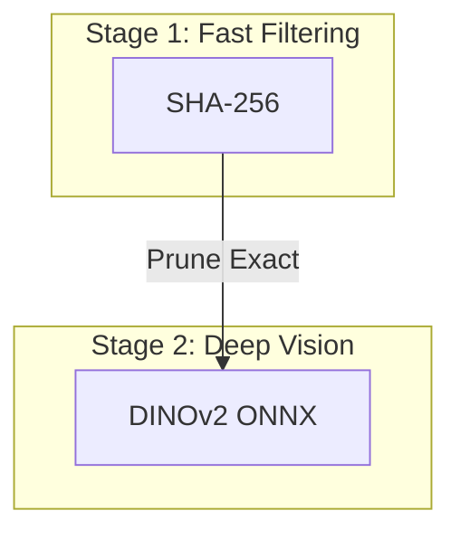

# Reference: GitHub-Native Mermaid.js Diagramming

## 1. Overview
GitHub Markdown natively renders Mermaid.js blocks (```mermaid ... ```) directly into interactive, theme-responsive vector SVGs.

---

## 2. Supported Diagram Types on GitHub
- **Flowcharts / Graphs**: `flowchart TD`, `flowchart LR`, `graph TD`
- **Sequence Diagrams**: `sequenceDiagram`
- **Class Diagrams**: `classDiagram`
- **State Diagrams**: `stateDiagram-v2`
- **Entity Relationship**: `erDiagram`

---

## 3. Styling & Dark-Mode Compatibility

### Class Definition (`classDef`)


### Clickable Interactive Nodes
Mermaid on GitHub supports interactive hyperlinks:


---

## 4. Subgraphs & Pipeline Modeling
Use subgraphs to visually encapsulate pipeline tiers and feedback loops:

