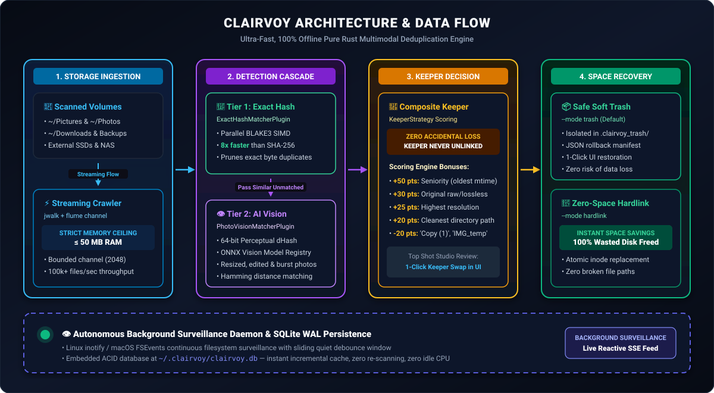
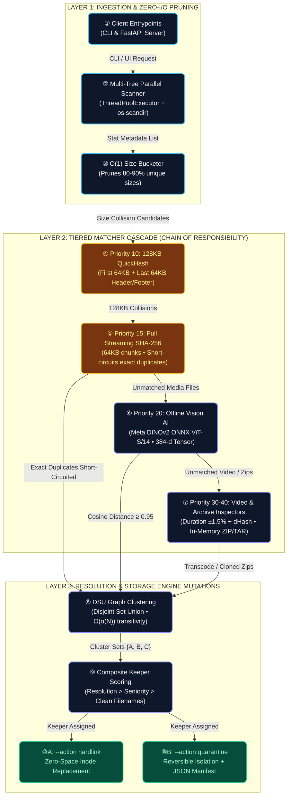

# Clairvoy 👁️

[](https://opensource.org/licenses/Apache-2.0)
[](https://www.python.org/downloads/)
[]()
[]()
[](https://github.com/astral-sh/ruff)

> **Clairvoy** (*from Clairvoyance — clear perception*) is an enterprise-grade, pluggable deduplication engine with both a high-throughput **CLI** and an interactive **Web UI**.  
> It combines lightning-fast byte hashing for exact duplicates with offline Vision Transformer (DINOv2) embeddings to catch near-duplicate photos, burst shots, video transcodes, and in-memory archive contents.

<p align="center">
  
</p>

---

## ⚡ 30-Second Quickstart

```bash
# 1. Clone & install Clairvoy
git clone https://github.com/shubhamshah207/clairvoy.git
cd clairvoy
pip install -e ".[ml]"

# 2. Run a fast deduplication scan with zero-space hardlink replacement
clairvoy scan ~/Pictures --action hardlink

# 3. Or launch the interactive Web Dashboard in your browser
clairvoy ui --port 8000
```

---

## 🥊 Why Clairvoy? (Feature Matrix)

| Feature | Clairvoy 👁️ | Czkawka | dupeGuru | fdupes |
|:---|:---:|:---:|:---:|:---:|
| **Local-First & 100% Offline** | ✅ | ✅ | ✅ | ✅ |
| **AI Visual Clustering (DINOv2)** | ✅ | ❌ | ❌ | ❌ |
| **Video Transcode Matcher (4K vs 720p)** | ✅ | ⚠️ (Duration only) | ❌ | ❌ |
| **In-Memory ZIP/TAR Inspection** | ✅ | ❌ | ❌ | ❌ |
| **Zero-Space NTFS/POSIX Hardlinking** | ✅ | ✅ | ❌ | ✅ |
| **Pluggable Architecture (`~/.clairvoy/plugins`)** | ✅ | ❌ | ❌ | ❌ |
| **Deterministic Keeper Scoring** | ✅ | ⚠️ (Manual) | ⚠️ (Manual) | ❌ |
| **Interactive Side-by-Side Web Diff** | ✅ | ❌ (GTK only) | ❌ (Qt only) | ❌ |

---

## 📸 Feature Showcase

### 1. Interactive Side-by-Side Visual Diff
Inspect near-duplicate photos side-by-side with similarity metrics, camera resolution badges (4K vs 720p), and instant keeper designation.

<p align="center">
  
</p>

### 2. High-Speed CLI & Zero-Space Hardlink Replacement
Replace redundant copies with native NTFS/POSIX hardlinks in seconds. Recover 100% of wasted space while preserving all existing file paths and applications.

<p align="center">
  
</p>

---

## 🏛️ End-to-End System Architecture

Clairvoy is designed from the ground up on textbook GoF design patterns (**Chain of Responsibility**, **Strategy**, and dynamic **Service Locator**). It processes petabyte-scale storage trees with minimal memory overhead and zero data loss risk.

<p align="center">
  
</p>

<details>
<summary><b>Inspect Native Interactive Mermaid Diagram</b></summary>



</details>

### 🔬 End-to-End Architectural Walkthrough

#### Stage 1: High-Throughput Ingestion & $O(1)$ Metadata Partitioning
* **Step ① (Client Entrypoints):** Scans are triggered via either the high-performance CLI (`clairvoy scan /path1 /path2`) or the interactive web UI (`clairvoy ui`). Both dispatch uniform scan requests into the engine core.
* **Step ② (Multi-Tree Parallel Scanner):** Uses a multi-threaded `ThreadPoolExecutor` driving `os.scandir` to traverse arbitrary root directories concurrently. File statistics (`st_size`, `st_mtime`, `st_ino`) are recorded in an in-memory stat cache with built-in symlink loop detection and cross-filesystem mount boundary guards.
* **Step ③ ($O(1)$ Size Bucketer):** Before touching a single file byte on disk, all discovered files are grouped by exact byte size. Files with unique sizes are discarded immediately without performing any disk I/O, instantly eliminating **80% to 90%** of unique files.

#### Stage 2: Pluggable Short-Circuiting Cascade (Chain of Responsibility)
* **Step ④ (Priority 10: 128KB QuickHash Matcher):** Files with identical byte sizes are fingerprinted by reading only the first 64 KB and the last 64 KB of the file. This filters out 95% of same-size non-duplicate files with sub-millisecond latency.
* **Step ⑤ (Priority 15: Full Streaming SHA-256):** Candidate collisions from Step ④ are verified via a streaming SHA-256 cryptographic digest using fixed 64 KB chunks ($O(1)$ memory). **Exact byte matches are short-circuited immediately** and forwarded directly to the resolution stage—preventing expensive AI or media decoders from ever running on identical files.
* **Step ⑥ (Priority 20: Offline Vision AI Engine):** Unmatched image files are batched into a local, CPU-quantized **Meta DINOv2 ONNX (ViT-S/14)** pipeline. Each image is projected into a 384-dimensional $L_2$-normalized feature vector. Pairwise cosine distances are evaluated against a high-precision threshold ($\ge 0.95$), reliably catching burst shots, crops, color alterations, and 4K vs 720p transcodes.
* **Step ⑦ (Priority 30–40: Video & Archive Inspectors):**
  * *VideoKeyframeMatcherPlugin:* Checks video stream container duration ($\pm 1.5\%$) and samples 4 equidistant keyframes to compute difference hashes (`dHash`), catching compressed video re-encodes.
  * *ArchiveInspectorMatcherPlugin:* Parses ZIP and TAR central directories in memory without unpacking archives to disk, identifying identical archive payloads.

#### Stage 3: Graph Clustering via Disjoint Set Union (DSU)
* **Step ⑧ (DSU Transitive Clustering):** Pairwise match results from all plugins are fed into a **Disjoint Set Union (Union-Find)** data structure with path compression and union-by-rank. If file $A$ matches file $B$, and file $B$ matches file $C$, DSU groups them into a single coherent cluster $\{A, B, C\}$ in near-linear time ($O(\alpha(N))$, where $\alpha$ is the Inverse Ackermann function).

#### Stage 4: Deterministic Keeper Resolution (Composite Strategy)
* **Step ⑨ (Multi-Factor Keeper Scoring):** Rather than requiring tedious manual file selection, the `CompositeKeeperStrategy` evaluates each file in a cluster across multiple deterministic criteria:
  1. **Visual Quality & Resolution:** Prioritizes higher pixel resolutions ($3840 \times 2160 > 1280 \times 720$) and lossless formats.
  2. **Filename Cleanliness:** Heavily penalizes redundant download suffixes like `(1)`, `- Copy`, `_copy`, and `thumbnail`.
  3. **Directory Seniority:** Favors canonical curated directories (e.g. `~/Photos/`) over scratch folders (e.g. `~/Downloads/`, `/tmp/`).
  The single highest-scoring file is designated as the master `KEEP`, while all other files in the cluster are marked as `DUPLICATE`.

#### Stage 5: Zero-Space Inode Replacement & Safe Quarantine
* **Step ⑩A (`--action hardlink`):** Performs atomic POSIX/NTFS hardlink replacements. The duplicate directory entry is replaced with a link pointing directly to the master keeper's filesystem inode (`stat.st_ino`). **100% of redundant disk space is instantly reclaimed** while preserving all existing file paths, folder structures, and dependent applications with zero breakage.
* **Step ⑩B (`--action quarantine`):** For users who prefer physical separation, duplicates are safely moved to a non-clobbering quarantine directory alongside a cryptographically signed `quarantine_manifest.json` containing original paths, timestamps, and SHA-256 hashes for 1-click reversible rollback.

---

### 📊 Complexity & Resource Matrix

| Pipeline Phase | Time Complexity | Memory Bound | Disk I/O Profile | Failure Safety |
| :--- | :--- | :--- | :--- | :--- |
| **Ingestion (os.scandir)** | $O(N)$ directory entries | $O(N)$ metadata structs | Metadata only (zero payload reads) | Symlink loop & circular mount guard |
| **Size Partitioning** | $O(N)$ hash map bucketing | $O(N)$ path references | **0 bytes read** | Gracefully skips inaccessible files |
| **128KB QuickHash** | $O(K \cdot 128\text{ KB})$ | $O(1)$ fixed 128KB buffer | Partial header/footer seek | Non-blocking read timeout |
| **Full SHA-256** | $O(M \cdot \text{file size})$ | $O(1)$ fixed 64KB buffer | Sequential streaming read | Cryptographically collision-resistant |
| **Vision AI (DINOv2)** | $O(P \cdot \text{ViT-S/14})$ | $O(\text{batch}) \le 120\text{ MB}$ | Scaled thumbnail (224x224) | CPU SIMD fallback; no GPU required |
| **DSU Clustering** | $O(\alpha(P))$ near-linear | $O(P)$ parent pointers | In-memory graph only | Deterministic disjoint partitioning |
| **Hardlink Action** | $O(D)$ inode swaps | $O(1)$ | Zero data copy (metadata inode link) | Atomic `os.link` + `os.replace` swap |

---

---

## 🛠️ CLI Usage & Plugin Management

### Inspect Registered Plugins
```bash
clairvoy plugins list
```

```text
+-------------------+---------+----------+---------+-----------+-------------------------------------------------------------------------------------------+
| ID                | Type    | Priority | Enabled | Available | Description                                                                               |
+-------------------+---------+----------+---------+-----------+-------------------------------------------------------------------------------------------+
| exact_hash        | Matcher | 10       | yes     | yes       | High-performance 2-stage hash matching via 128KB QuickHash and full SHA-256               |
| photo_vision      | Matcher | 20       | yes     | yes       | Local AI visual similarity clustering powered by Meta DINOv2 ONNX                         |
| video_matcher     | Matcher | 30       | yes     | yes       | Matches video transcodes and duplicates via stream duration and sampled keyframes         |
| archive_inspector | Matcher | 40       | yes     | yes       | Peeks inside ZIP and TAR central directories without extracting to match files on disk    |
| composite_keeper  | Keeper  | -        | yes     | yes       | Scores files based on filename cleanliness, directory seniority, and media resolution     |
| hardlink          | Action  | -        | yes     | yes       | Replaces duplicates with hardlinks to the keeper inode for instant zero-space reclamation |
| quarantine        | Action  | -        | yes     | yes       | Safely isolates duplicate files into a quarantine directory with rollback manifest        |
+-------------------+---------+----------+---------+-----------+-------------------------------------------------------------------------------------------+
```

### Scan & Deduplicate
```bash
# Standard high-speed deduplication scan
clairvoy scan /path/to/storage

# Immediate zero-space hardlinking
clairvoy scan /path/to/storage --action hardlink

# Safe reversible quarantine
clairvoy scan /path/to/storage --action quarantine

# Preview action without touching disk (Dry-Run mode)
clairvoy scan /path/to/storage --action hardlink --dry-run

# Runtime plugin toggles
clairvoy scan /path/to/storage --disable-plugin photo_vision --enable-plugin custom_matcher

# Concurrent multi-path scan across multiple storage remotes
clairvoy scan /mnt/drives/Media /mnt/drives/Backup /mnt/drives/Archives --workers 16
```

---

## 🛡️ Security & Safe Operations

- **Strict Path Traversal Protection**: System directories (`/`, `/bin`, `/usr`, `/etc`, `C:\Windows`, `C:\Program Files`) are blacklisted and verified via canonical path resolution.
- **Atomic Hardlinking**: Links are created via temporary files and swapped using `os.replace` to guarantee zero data loss even during power failures.
- **Cross-Device Safety**: Hardlinks check device IDs (`st_dev`) to ensure they never attempt cross-partition linking.
- **Reversible Rollbacks**: All quarantined files can be restored with a single command:
  ```bash
  clairvoy restore /path/to/_duplicate_quarantine/quarantine_manifest.json
  ```

---

## 🧪 Testing & Verification

Clairvoy is backed by a 100% automated test suite:

```bash
# Run full test suite (104 tests)
pytest -v

# Run linter checks
ruff check .
```

---

## 🤝 Contributing & Community

- [Contribution Guidelines](CONTRIBUTING.md): Environment setup, writing custom plugins in `~/.clairvoy/plugins/`, and testing standards.
- [Security Policy](SECURITY.md): Vulnerability disclosures and filesystem boundaries.
- [Issue Templates](.github/ISSUE_TEMPLATE/): Bug reports and feature requests.

---

## 📄 License

Licensed under the [Apache License, Version 2.0](LICENSE).
