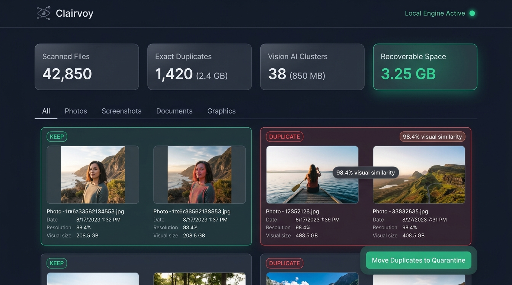
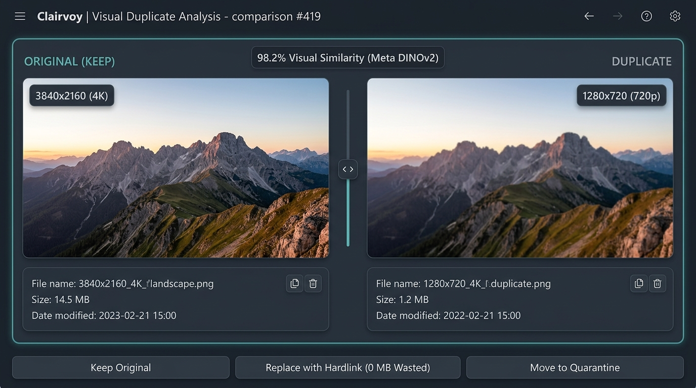
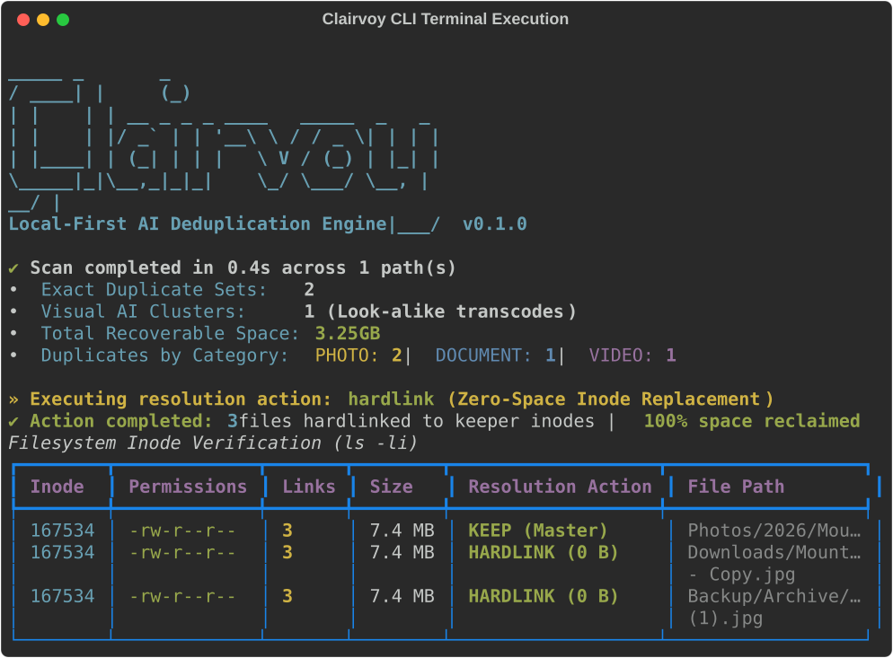

# Clairvoy 👁️

[](https://opensource.org/licenses/Apache-2.0)
[](https://www.python.org/downloads/)
[]()
[]()
[](https://github.com/astral-sh/ruff)

> **Clairvoy** (*from Clairvoyance — clear perception*) is an enterprise-grade, pluggable deduplication engine with both a high-throughput **CLI** and an interactive **Web UI**.  
> It combines lightning-fast byte hashing for exact duplicates with offline Vision Transformer (DINOv2) embeddings to catch near-duplicate photos, burst shots, video transcodes, and in-memory archive contents.

<p align="center">
  
</p>

---

## ⚡ 30-Second Quickstart

```bash
# 1. Clone & install Clairvoy
git clone https://github.com/shubhamshah207/clairvoy.git
cd clairvoy
pip install -e ".[ml]"

# 2. Run a fast deduplication scan with zero-space hardlink replacement
clairvoy scan ~/Pictures --action hardlink

# 3. Or launch the interactive Web Dashboard in your browser
clairvoy ui --port 8000
```

---

## 🥊 Why Clairvoy? (Feature Matrix)

| Feature | Clairvoy 👁️ | Czkawka | dupeGuru | fdupes |
|:---|:---:|:---:|:---:|:---:|
| **Local-First & 100% Offline** | ✅ | ✅ | ✅ | ✅ |
| **AI Visual Clustering (DINOv2)** | ✅ | ❌ | ❌ | ❌ |
| **Video Transcode Matcher (4K vs 720p)** | ✅ | ⚠️ (Duration only) | ❌ | ❌ |
| **In-Memory ZIP/TAR Inspection** | ✅ | ❌ | ❌ | ❌ |
| **Zero-Space NTFS/POSIX Hardlinking** | ✅ | ✅ | ❌ | ✅ |
| **Pluggable Architecture (`~/.clairvoy/plugins`)** | ✅ | ❌ | ❌ | ❌ |
| **Deterministic Keeper Scoring** | ✅ | ⚠️ (Manual) | ⚠️ (Manual) | ❌ |
| **Interactive Side-by-Side Web Diff** | ✅ | ❌ (GTK only) | ❌ (Qt only) | ❌ |

---

## 📸 Feature Showcase

### 1. Interactive Side-by-Side Visual Diff
Inspect near-duplicate photos side-by-side with similarity metrics, camera resolution badges (4K vs 720p), and instant keeper designation.

<p align="center">
  
</p>

### 2. High-Speed CLI & Zero-Space Hardlink Replacement
Replace redundant copies with native NTFS/POSIX hardlinks in seconds. Recover 100% of wasted space while preserving all existing file paths and applications.

<p align="center">
  
</p>

---

## 🏛️ Pluggable Pipeline Architecture

Clairvoy is built on textbook GoF design patterns (**Pipeline / Chain of Responsibility**, **Strategy**, and dynamic **Service Locator**):

```text
+---------------------------------------------------------------------------------------------------------+
|                                              CLAIRVOY PLUGGABLE ARCHITECTURE                            |
+---------------------------------------------------------------------------------------------------------+
|                                                                                                         |
|                                                  PluginRegistry                                         |
|                     - Drop-ins: ~/.clairvoy/plugins/*.py  - Entry Points: clairvoy.plugins              |
|                                                                                                         |
|       +-----------------------------------------------------------------------------------------+       |
|       |                                        DeduplicationPipeline                            |       |
|       |                                (Short-Circuit Pruning & Priority Chain)                 |       |
|       +-----------------------------------------------------------------------------------------+       |
|                                     |                                                      |            |
|           [Matcher Chain by Priority]                                     [Scoring & Resolution]        |
|                                     v                                                      v            |
|       +---------------------------------------------+               +---------------------------+       |
|       | Priority 10: ExactHashMatcherPlugin         |               | CompositeKeeperStrategy   |       |
|       |  |--> 128KB QuickHash + Streaming SHA-256   |               |  |--> Filename penalties  |       |
|       +---------------------------------------------+               |       ((1), -copy, thumb) |       |
|                             | [prune matched files]                 |  |--> Directory seniority |       |
|                             v                                       |  |--> Media resolution   |       |
|       +---------------------------------------------+               +---------------------------+       |
|       | Priority 20: PhotoVisionMatcherPlugin       |                                      |            |
|       |  |--> Meta DINOv2 ONNX + DSU Clustering     |                                      v            |
|       +---------------------------------------------+               +---------------------------+       |
|                             | [prune matched files]                 | Action Plugins:           |       |
|                             v                                       |  |--> SafeQuarantine      |       |
|       +---------------------------------------------+               |       (Non-clobbering)    |       |
|       | Priority 30: VideoKeyframeMatcherPlugin     |               |  |--> HardlinkAction      |       |
|       |  |--> Duration (±1.5%) + Keyframe dHash     |               |       (Zero-space inode)  |       |
|       +---------------------------------------------+               +---------------------------+       |
|                             | [prune matched files]                                                     |
|                             v                                                                           |
|       +---------------------------------------------+                                                   |
|       | Priority 40: ArchiveInspectorMatcherPlugin  |                                                   |
|       |  |--> ZIP & TAR In-Memory Central Dir Peek  |                                                   |
|       +---------------------------------------------+                                                   |
+---------------------------------------------------------------------------------------------------------+
```

### Core Suite of Default Plugins
1. **ExactHashMatcherPlugin** (`priority = 10`): Two-stage byte verification via 128KB QuickHash and full streaming SHA-256.
2. **PhotoVisionMatcherPlugin** (`priority = 20`): Local quantized Meta DINOv2 ONNX embeddings with Disjoint Set Union clustering.
3. **VideoKeyframeMatcherPlugin** (`priority = 30`): Video container stream duration matching ($\pm 1.5\%$) and 10%, 50%, 90% keyframe dHash comparisons to catch transcodes (e.g. 4K original vs 720p WhatsApp share).
4. **ArchiveInspectorMatcherPlugin** (`priority = 40`): In-memory ZIP and TAR central directory peeking without disk extraction.
5. **CompositeKeeperStrategy**: Multi-signal scoring engine penalizing copy suffixes (`(1)`, `-copy`), trash folders, and rewarding directory seniority and higher image resolutions.
6. **SafeQuarantineActionPlugin**: Non-clobbering reversible file isolation with machine-readable `quarantine_manifest.json` and 1-click restore.
7. **HardlinkActionPlugin**: Zero-space NTFS and POSIX atomic inode replacement with partition boundary safety checks.

---

## 🛠️ CLI Usage & Plugin Management

### Inspect Registered Plugins
```bash
clairvoy plugins list
```

```text
+-------------------+---------+----------+---------+-----------+-------------------------------------------------------------------------------------------+
| ID                | Type    | Priority | Enabled | Available | Description                                                                               |
+-------------------+---------+----------+---------+-----------+-------------------------------------------------------------------------------------------+
| exact_hash        | Matcher | 10       | yes     | yes       | High-performance 2-stage hash matching via 128KB QuickHash and full SHA-256               |
| photo_vision      | Matcher | 20       | yes     | yes       | Local AI visual similarity clustering powered by Meta DINOv2 ONNX                         |
| video_matcher     | Matcher | 30       | yes     | yes       | Matches video transcodes and duplicates via stream duration and sampled keyframes         |
| archive_inspector | Matcher | 40       | yes     | yes       | Peeks inside ZIP and TAR central directories without extracting to match files on disk    |
| composite_keeper  | Keeper  | -        | yes     | yes       | Scores files based on filename cleanliness, directory seniority, and media resolution     |
| hardlink          | Action  | -        | yes     | yes       | Replaces duplicates with hardlinks to the keeper inode for instant zero-space reclamation |
| quarantine        | Action  | -        | yes     | yes       | Safely isolates duplicate files into a quarantine directory with rollback manifest        |
+-------------------+---------+----------+---------+-----------+-------------------------------------------------------------------------------------------+
```

### Scan & Deduplicate
```bash
# Standard high-speed deduplication scan
clairvoy scan /path/to/storage

# Immediate zero-space hardlinking
clairvoy scan /path/to/storage --action hardlink

# Safe reversible quarantine
clairvoy scan /path/to/storage --action quarantine

# Preview action without touching disk (Dry-Run mode)
clairvoy scan /path/to/storage --action hardlink --dry-run

# Runtime plugin toggles
clairvoy scan /path/to/storage --disable-plugin photo_vision --enable-plugin custom_matcher

# Concurrent multi-path scan across multiple storage remotes
clairvoy scan /mnt/drives/Media /mnt/drives/Backup /mnt/drives/Archives --workers 16
```

---

## 🛡️ Security & Safe Operations

- **Strict Path Traversal Protection**: System directories (`/`, `/bin`, `/usr`, `/etc`, `C:\Windows`, `C:\Program Files`) are blacklisted and verified via canonical path resolution.
- **Atomic Hardlinking**: Links are created via temporary files and swapped using `os.replace` to guarantee zero data loss even during power failures.
- **Cross-Device Safety**: Hardlinks check device IDs (`st_dev`) to ensure they never attempt cross-partition linking.
- **Reversible Rollbacks**: All quarantined files can be restored with a single command:
  ```bash
  clairvoy restore /path/to/_duplicate_quarantine/quarantine_manifest.json
  ```

---

## 🧪 Testing & Verification

Clairvoy is backed by a 100% automated test suite:

```bash
# Run full test suite (104 tests)
pytest -v

# Run linter checks
ruff check .
```

---

## 🤝 Contributing & Community

- [Contribution Guidelines](CONTRIBUTING.md): Environment setup, writing custom plugins in `~/.clairvoy/plugins/`, and testing standards.
- [Security Policy](SECURITY.md): Vulnerability disclosures and filesystem boundaries.
- [Issue Templates](.github/ISSUE_TEMPLATE/): Bug reports and feature requests.

---

## 📄 License

Licensed under the [Apache License, Version 2.0](LICENSE).
